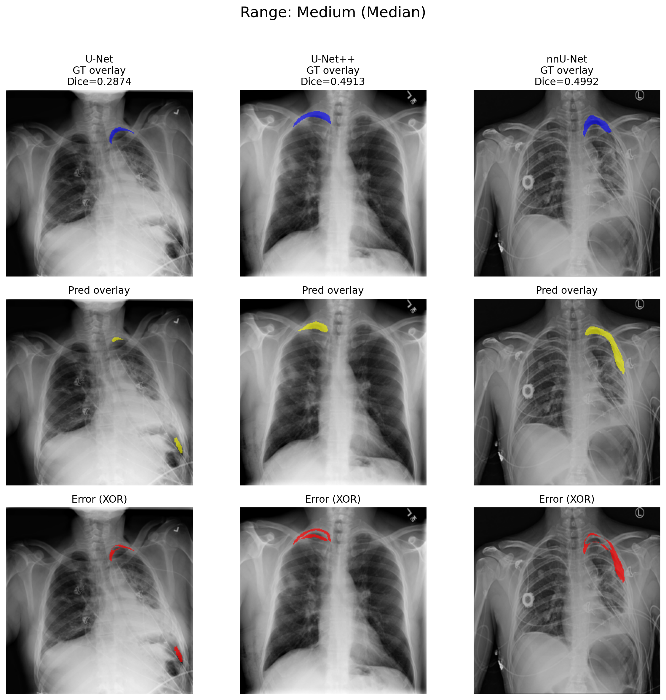
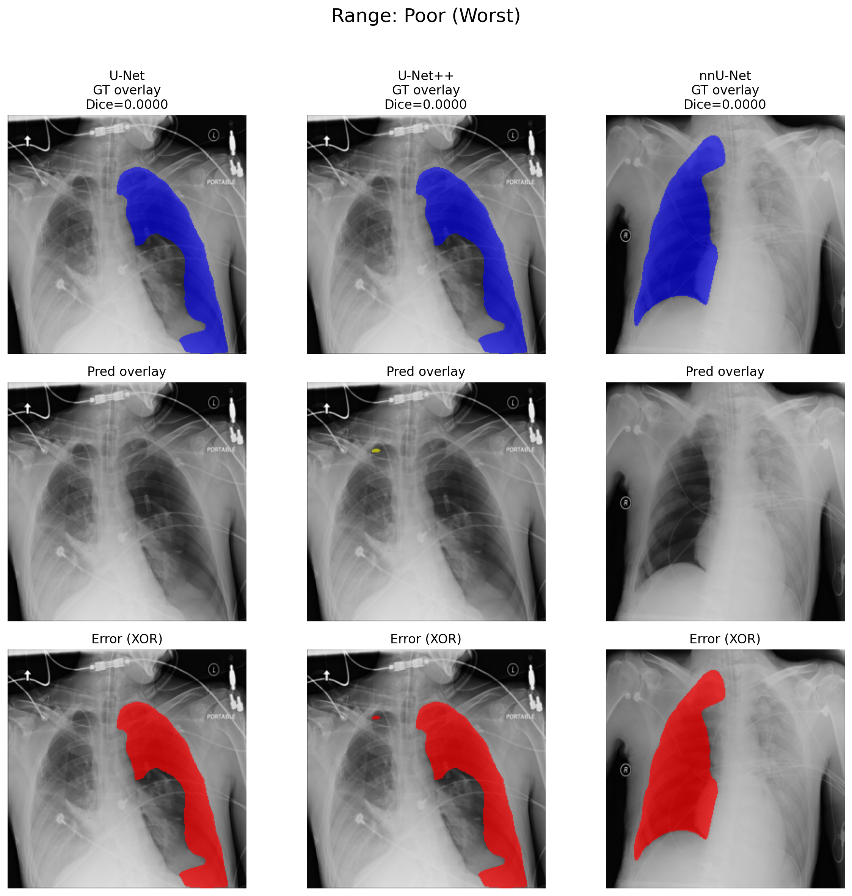
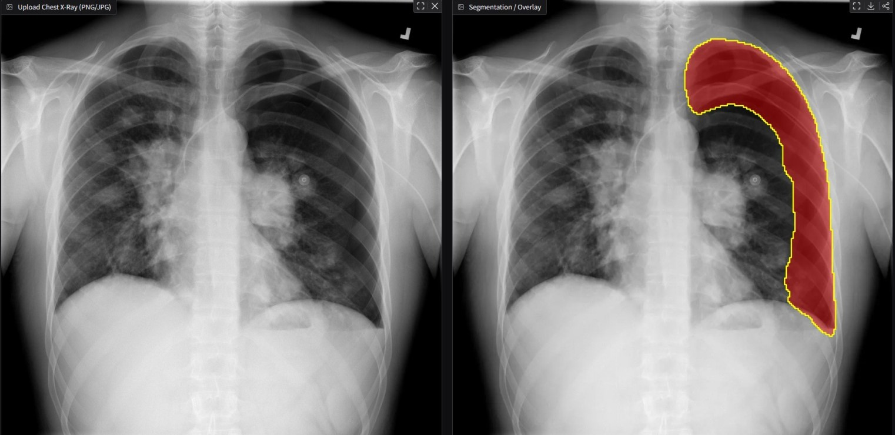
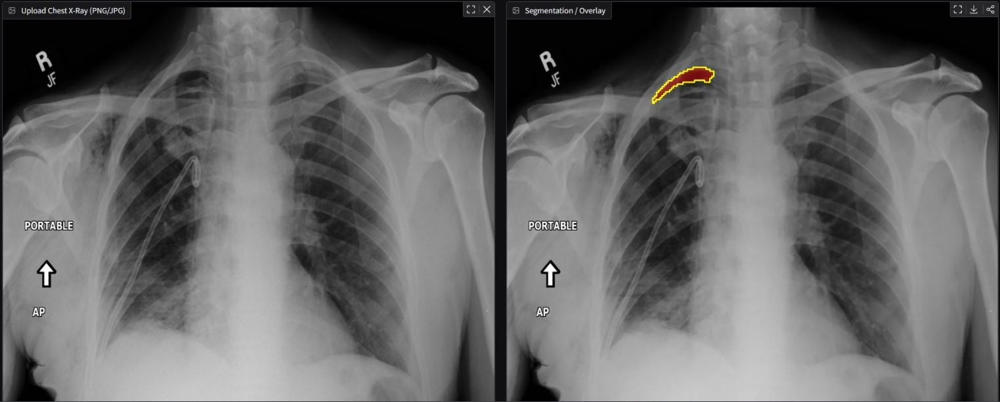
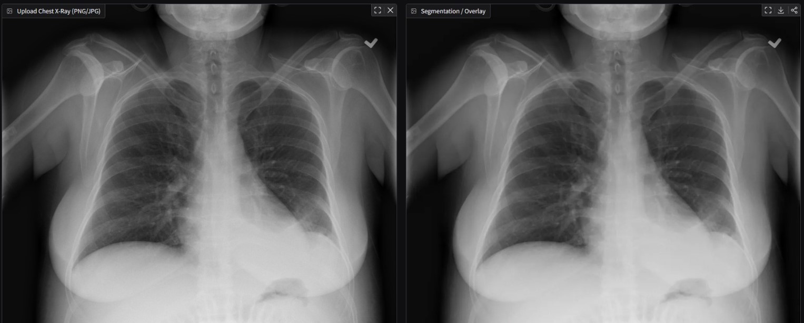
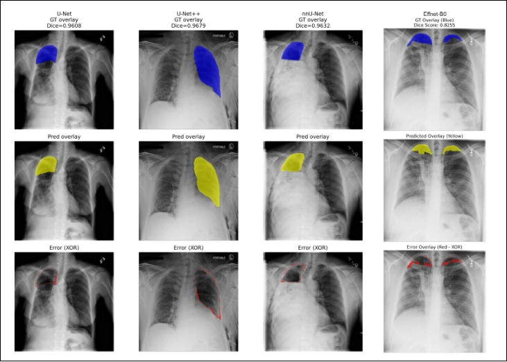

# PTX_FYP — Pneumothorax Segmentation Suite

Unified repository for multiple pneumothorax segmentation models, evaluation pipelines, and severity estimation.

## Repository Tree

```
Repository tree for d:/github/PTX_FYP

checkpoints/
    M1/
        autoencoder_best.pth
        ptxseg_net_dice_best.pth
        ptxseg_net_high_lr_best.pth
    M2/
        unet_r50_1024_focal.pth
    M3/
        unet_effnet_b4_1024_focal.pth
        unet_effnet_b4.pth
    M4/
        U-Net_best.pth
    M5/
        U-Net++_best.pth
    M6/
        nnU-Net_best.pth
    M7/
        unet_effnet_b0_fast.pth

extras/

results/
    M1_M2_M3/
        csv/
            per_image_metrics.csv
            summary_metrics.csv
        png/
    M4_M5_M6/
        csv/
            evaluation_summary.csv
            per_image_metrics.csv
        plots/
        png/
    M7/
        csv/
            evaluation_summary.csv
        png/
    severity/
        csv/
            severity_estimates.csv
        png/
    valid_overlays/

scripts/
    severity.py
    train_any_model.py
    verify.py
    M1_M2_M3/
        README.md
        requirements.txt
        configs/
            config.yaml
        datasets/
            siim_dataset.py
        evaluation/
            evaluate_models.py
            visualize_comparison.py
        inference/
            predict_single.py
        models/
            __init__.py
            ptxsegnet.py
            unet_effnetb4.py
            unet_resnet50.py
        training/
            train_models.py
        utils/
            checkpoint.py
            losses.py
            metrics.py
            postprocess.py
            tta.py
            visualization.py
    M4_M5_M6/
        README.md
        requirements.txt
        configs/
            config.yaml
        datasets/
            siim_rgb_dataset.py
        evaluation/
            compare_positive_samples.py
            evaluate_smp_models.py
            metrics_report.py
            overlay_best_median_worst.py
            visualize_overlays.py
        models/
            smp_models.py
        training/
            train_smp_models.py
        utils/
            metrics.py
            model_utils.py
            train_helpers.py
            visualization.py
    M7/
        predict_effnet_b0.py
        README.md
        requirements.txt
        train_effnet_b0.py
        visualize_effnet_b0.py
        datasets/
            pneumothorax_dataset.py
        evaluation/
            evaluate_effnet.py
        inference/
            predict_single.py
        models/
            unet_effnet_b0.py
        training/
            train_effnetb0.py
        utils/
            metrics.py
        visualization/
            visualize_comparison.py
```

---

## Installation

```
pip install -r requirements.txt
```

### Unified Requirements

```
torch
torchvision
numpy
opencv-python
scipy
pandas
matplotlib
tqdm
segmentation-models-pytorch
timm
pydicom
Pillow
pyyaml
scikit-learn
```

---

## Evaluation Outputs

### Best / Median / Worst Cases

Saved under:

```
results/*/plots/
results/*/png/
```

Example figures:





---

### Severity Estimation Examples

Saved under:

```
results/severity/png/
```





---

### Valid Overlay Samples

```
results/valid_overlays/
```



---

## Models Included

### Group M1–M3
Custom PTXSegNet and U‑Net variants with EfficientNet/ResNet encoders.

### Group M4–M6
SMP‑based models:

- U‑Net
- U‑Net++
- nnU‑Net‑style baseline

### Group M7
Fast EfficientNet‑B0 U‑Net variant.

---

## Severity Estimation

Produces:

- Pneumothorax area
- Hemithorax area estimate
- Severity percentage
- Clinical category

Output files:

```
results/severity/csv/severity_estimates.csv
results/severity/png/
```

---

## License

MIT License
